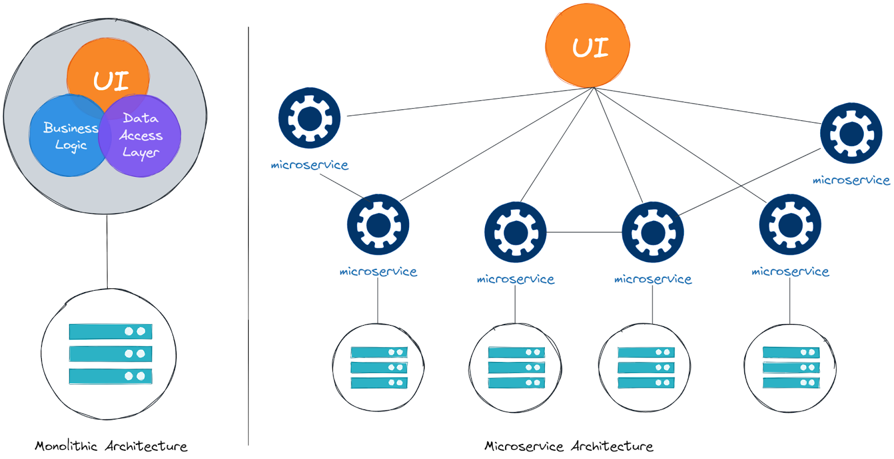

## Fundamentals

### **Monolithic Applications:**

A monolithic application would include all functionality from user interface, product listing, shopping cart, checkout, processing orders. 

#### Disadvantages

Difficult to manage complexity, scale development across multiple teams, implement changes fast and scale application efficiently when its under load.

### **Cloud Native Applications** 

Cloud native application are broken down into smaller easy to manage.

Decoupled application that communicate over the network

Microservices: Small independent applications with clearly defined scope and functions

## Characteristics of Cloud Native Architecture

### High Level of automation

- automation in development and deployment

- Can be achieved using Continuous Integration/Continuous Delivery(CI/CD) pipelines backed by version control system like git

- Building, testing & deployment of applications with minimal human involvement allows for fast, frequent & incremental changes to production

- Reliable automated system allows for much easier disaster recovery

  

### Self healing

- Applications contain health checks to monitor application from inside
- If one part of the application fails/stops working the other parts dont get effected

### Scalable

Scaling is the process of handling more users/load while still providing pleasent experience 12 Factor App

- Multiple copies of applications and distributing the load
- Automating this behavior based on application metrics like CPU and memory

### Cost-efficient

- ability to scale down the application when traffic is low
- Kubernetes can help with more efficient and denser placing of applications

### Easy to maintain

Using *Microservices* allows to break down applications in  smaller pieces and make them more portable, easier to test and to  distribute across multiple teams.

### Secure by default

Zero trust computing mitigates by requiring authentication from every user and process.

**12 Factor App**

[twelve-factor app](https://12factor.net/) is a guideline for developing cloud native applications
