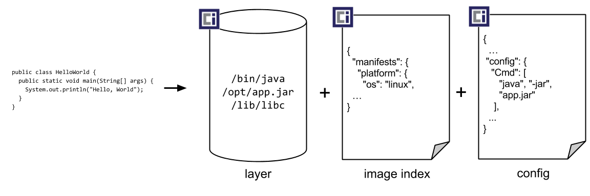

## Use of Containers

Generic steps to run a web application, written in Python, on a server or a local machine

1. Install and configure an operating system
2. Install core python packages
3. Install python extensions specific to the program for eg. requirements.txt
4. configure networking in the the system
5. connect to databases or cache or storage(for eg. filer)

Servers are configured for a single purpose like for a database or an application then connect it to the network.

- VMs can be used on top of single hardware to isolate the environments.
- but VMs use the full operating system including the kernel which comes with an overhead
- Containers can solve this problem of managing the dependencies and running more effeciently than VMs


## Container Basics

- `chroot` command can be earliest ancestor to the modern container technology

- `chroot` could isolate a process from the root file-system and "hide" the files from the process and simulate new root directory.

- *chroot* changes the root directory (every process/command in Linux/Unix has current working directory call root directory). A process/command that runs in such a modified/isolated environment cannot access files outside the root.

- The isolated environment is called chroot jail where files cant be accessed by the process but is still present on the system

- to isolate process even more than `chroot`, current linux kernels provide features like *namespaces* and *cgroups*.

  - *namespaces* are used to isolate various resources like network. A process can have its own IP address and this leads to a complete abstraction of network interfaces and routing tables.
  - Linux kernal provides namespaces for the following,
    - **pid** - process ID provides a process with its own set of process IDs.
    - **net** - network allows the processes to have their own network stack, including the IP address.
    - **mnt** - mount abstracts the file-system view and manages mount points.
    - **ipc** - inter-process communication provides separation of named shared memory segments.
    - **user** - provides process with their own set of user IDs and group IDs.
    - **uts** - Unix time sharing allows processes to have their own hostname and domain name.
    - **cgroup** - a newer namespace that allows a process to have its own set of cgroup root directories.
    - **time** - the newest namespace can be used to virtualize the clock of the system. 

  - *cgroups* are used to organize process in hierarchical groups and assign then resources like memory and CPU. An application can be limited to use for eg. 4GB of memory

  

### Container v. VMs

- *virtual machines* emulate a complete machine, including the operating  system and a kernel versus *containers* share the kernel of the host machine  and, as explained, are only isolated processes
- *Virtual machines* come with some overhead, be it boot time, size or  resource usage to run the operating system. *Containers* on the other hand are literally processes and they start a lot faster and have a smaller footprint.


## Running Containers

- Docker is not the only standard for running containers, Open Container Initiative (OCI) *runtime-spec* can also be used.
- OCI maintains *runC* which is a container runtime reference implementation, this low-level runtime is used in a variety of tools to start containers, including Docker.
- OOP analogy can be used for the relationship between a container image and a running container like class and the instantiation of the class.

```bash
docker run nginx
```

- *runtime-spec* of OCI goes together with *image-spec* and it describes 

  - how to unpack a container image
  - manage the complete container lifecycle
    - creating environment 
    - starting, stopping and deleting the process

- Alternatives for building images: [buildah](https://buildah.io/), [kaniko](https://github.com/GoogleContainerTools/kaniko) etc

- Full fledged applications: Docker, [podman](https://podman.io/)

  - podman has a similar API to Docker and can be used as a drop-in replacement
  - has additional features like running containers without root and concept of Pod

  ## Demo: Running Containers

  ### Docker

  ```bash
  docker version
  ```

  ```bash
  docker –help
  ```

- pre-built images on docker registry called docker hub

  ```
  docker run nginx:1.20 
  ```

- The above command runs the nginx container in the terminal and blocks any use of the terminal. To stop the container use just use `Ctrl+C`

- to run in detached mode use the following command

  ```bash
  docker run --detach --publish-all nginx:1.20 
  ```

  ```bash
  docker stop <container_id>
  ```

- the following command runs the wordpress site locally.

  ```
  docker run -d -p 80:80 tutum/wordpress
  ```

  

  ### Podman

  ```bash
  podman version
  podman --help
  podman run --detach --publish-all nginx:1.20
  podman ps
  podman stop <container_id>
  ```

  

## Building Container Images

- Container metaphor can be alluded to the container that ships carry and easy to handle whatever the contents of the container (ISO 668)

- Docker reused the components like namespaces and cgroups in addition crucially it used *container images*

- [Docker](https://www.docker.com/resources/what-container) describes a container image as following:

  *“A Docker container image is a  lightweight, standalone, executable package of software that includes  everything needed to run an application: code, runtime, system tools,  system libraries and settings.”*

- Docker image format was donated to the OCI as the OCI image-spec
  - an image consists of filesystem bundle and metadata



### **Container Images**

- images can be built by readinf the instructions from a buildfile called *Dockerfile*

```yaml
# Every container image starts with a base image.
# This could be your favorite linux distribution
FROM ubuntu:20.04 

# Run commands to add software and libraries to your image
# Here we install python3 and the pip package manager
RUN apt-get update && \
    apt-get -y install python3 python3-pip 

# The copy command can be used to copy your code to the image
# Here we copy a script called "my-app.py" to the containers filesystem
COPY my-app.py /app/ 

# Defines the workdir in which the application runs
# From this point on everything will be executed in /app
WORKDIR /app

# The process that should be started when the container runs
# In this case we start our python app "my-app.py"
CMD ["python3","my-app.py"]
```

The above script containerizes a python script and an image can be built using the following command

```bash
docker build -t my-python-image -f Dockerfile
```

where `-t my-python-image` can specify the name tag for the image and `-f Dockerfile` points to the Dockerfile path

- To distribute the image a container registry can be used to upload and download images using the following commands

```bash
docker push my-registry.com/my-python-image
docker pull my-registry.com/my-python-image
```


## Demo: Building Container Images

```bash
# lists all the images
docker images
# copy the source code from the github link cd to the app
cd app
#to dockerize the application from the source code you must create a Dockerfile in the application directory

```

The Dockerfile is as below

```yaml
# syntax=docker/dockerfile:1
# this line specifies the ase image to use;here it uses base image of node 
FROM node:18-alpine
WORKDIR /app
#copy the src to the container
COPY . .
# install dependencies 
RUN yarn install --production
CMD ["node", "src/index.js"]
EXPOSE 3000
```

```bash
#build image
docker build -t getting-started .
# run the image as a container
docker run --detach --publish 3000:3000 getting-started
```

## Security

- Not enough to rely on isolation properties of containers
- containers share the kernal of a machine, which becomes risky if the containers are allowed to call kernel functions  for eg. killing a process, modifying the host network by creating routing rules.
  - [kernel capabilities of Docker](https://docs.docker.com/engine/security/#linux-kernel-capabilities)

- Greatest risk is the execution of process with too many privileges especially starting processess as root or administrator.Lot of Docker images are currently run as root users
- Public registries are recently being used to introduce malicious software in the images
- Sysdig has a great [blog article on how to avoid a lot of security issues and build secure container images](https://sysdig.com/blog/dockerfile-best-practices/).

- 4C's of Cloud Native security. Make sure to cover every layer since it’s effectively protecting the layer within
- The [Kubernetes documentation](https://kubernetes.io/docs/concepts/security/overview/) is a good starting point to understand the layers.


